**Português** · [English](README.en.md)

# homelab

**Um nó. Seis máquinas. Tudo em Git.**

Laboratório doméstico construído sobre Proxmox VE, com a infraestrutura inteira declarada como código.
A única coisa que se instala à mão é o hipervisor. A partir daí, cada VM, cada contentor, cada regra de
firewall e cada operador do OpenShift nascem de um ficheiro versionado neste repositório.

O objectivo não é hospedar serviços. É ter um sítio onde partir coisas de propósito — um cluster de
Kafka a perder um broker, um consumidor idempotente a receber a mesma mensagem duas vezes, um
rollback de GitOps às três da manhã — sem que ninguém a sério esteja a pagar por isso.

<p align="center">
  
</p>

---

## Índice

| Secção | O que responde |
|---|---|
| [Porquê](#porquê) | Que problema é que este lab resolve |
| [Hardware](#hardware) | O que está dentro da caixa |
| [Rede](#rede) | Como o tráfego é separado com uma só NIC |
| [Virtualização](#virtualização) | Quem recebe que CPU, que RAM e que GPU |
| [Capacidade](#capacidade) | Porque é que nem tudo liga ao mesmo tempo |
| [Fluxo de trabalho](#fluxo-de-trabalho) | Do MacBook até ao cluster |
| [Plataforma](#plataforma) | O que corre dentro do OpenShift |
| [Estrutura do repositório](#estrutura-do-repositório) | Onde está cada coisa |
| [Arranque](#arranque) | Como se põe isto de pé do zero |
| [Convenções](#convenções) | Segredos, decisões, nomes |
| [Estado](#estado) | O que já funciona e o que ainda não |
| [Percurso de estudo](docs/percurso.md) | Em que ordem aprender isto, e o que saber antes de avançar |

---

## Porquê

Trabalho todos os dias com microserviços Quarkus em OpenShift, desacoplados por Kafka, entregues por
Argo CD. O que não tenho no trabalho é permissão para destruir o cluster à sexta-feira para ver o que
acontece.

Este lab existe para três coisas:

1. **Operar a stack de baixo para cima.** Saber desenhar um sistema distribuído e saber instalar o
   OpenShift num nó só, com o seu DNS e o seu armazenamento, são competências diferentes. Esta é a
   segunda.
2. **Praticar infraestrutura como código a sério.** Se uma máquina não pode ser destruída e recriada
   a partir do repositório, não conta. É a regra que dá forma a tudo o que está aqui.
3. **Ter uma consola decente na sala.** O mesmo hardware que compila imagens nativas GraalVM à
   tarde corre Steam à noite. Não por poupança — por gosto pelo problema de a mesma GPU pertencer a
   uma VM de cada vez.

Não é um projecto de produção e o repositório não finge que é. Onde uma decisão foi tomada por
limitação de orçamento ou de hardware, está escrita como tal.

---

## Hardware

Máquina única, montada para correr 24/7 em silêncio, com folga para uma carga pesada de cada vez.

| Componente | Escolha | Porquê |
|---|---|---|
| CPU | AMD Ryzen 9 9950X3D — 16C / 32T | Dois CCDs com perfis diferentes: o CCD 0 tem 3D V-Cache e vai para o gaming, o CCD 1 tem frequência alta e leva o OpenShift e os builds |
| Motherboard | ASUS ROG Strix B850-I Gaming WiFi | Mini-ITX AM5; o slot x16 é ligado directamente ao CPU, o que dá um grupo IOMMU limpo para passthrough |
| RAM | Kingston FURY Beast 64 GB (2 × 32) DDR5-6000 CL30 EXPO | O recurso mais escasso do lab. Ver [Capacidade](#capacidade) |
| Armazenamento | Samsung 990 PRO 2 TB PCIe 4.0 NVMe | Pool ZFS única. O segundo slot M.2 está livre e é o próximo upgrade |
| GPU | Sapphire PULSE Radeon RX 9060 XT 16 GB | Passada inteira à VM Bazzite. A iGPU do 9950X3D fica com a consola do host |
| Rede | Realtek RTL8125 2.5 GbE | Uma só NIC — daí a segmentação ser 802.1Q e não física |
| Alimentação | Corsair SF850 (2024) 850 W SFX Platinum | Margem confortável e ventoinha parada em carga baixa |
| Arrefecimento | Thermalright AXP120-X67 | Ar, sem bomba a falhar num equipamento que nunca desliga |
| Caixa | Fractal Design Ridge | SFF vertical, GPU em câmara separada |

Detalhe completo, incluindo o mapa de cores por CCD e o orçamento térmico: **[docs/hardware.md](docs/hardware.md)**.

---

## Rede

Uma placa de rede, seis domínios de broadcast. O trunk 802.1Q entra num bridge VLAN-aware do Proxmox
e cada guest declara a etiqueta a que pertence. O router de casa não é tocado por este repositório —
se o lab arder, a família continua online.

<p align="center">
  
</p>

| VLAN | Nome | Sub-rede | Quem lá vive |
|---:|---|---|---|
| — | untagged | `192.168.1.0/24` | LAN de casa; perna WAN do OPNsense |
| 10 | `MGMT` | `10.10.10.0/24` | Proxmox, gestão do switch, Proxmox Backup Server |
| 20 | `PLATFORM` | `10.10.20.0/24` | OpenShift, Kafka, PostgreSQL, registry |
| 30 | `IOT` | `10.10.30.0/24` | Home Assistant e todo o firmware de terceiros |
| 40 | `GAMING` | `10.10.40.0/24` | Bazzite |
| 50 | `DEV` | `10.10.50.0/24` | Bancada de desenvolvimento |

A regra base entre VLANs é negar. O que passa está declarado em `ansible/` e é revisto em PR, não
adicionado na interface web à pressa. O domínio interno é `lab.home.arpa` — reservado pela
[RFC 8375](https://www.rfc-editor.org/rfc/rfc8375.html), ao contrário de `.local`, que colide com mDNS.

Detalhe, incluindo o plano de endereçamento e as regras inter-VLAN: **[docs/network.md](docs/network.md)**.

---

## Virtualização

<p align="center">
  
</p>

| Guest | Sistema | vCPU | RAM | Disco | VLAN | Ligado |
|---|---|---:|---:|---:|---:|---|
| `ocp-sno` | OpenShift 4.x Single-Node (RHCOS) | 12 · CCD 1 | 24 GB | 200 GB | 20 | sob procura |
| `devbox` | Fedora Silverblue (bootc) | 8 · CCD 1 | 16 GB | 150 GB | 50 | sob procura |
| `bazzite` | Bazzite (Fedora Atomic) | 8 · CCD 0 fixo | 16 GB | 250 GB | 40 | sob procura |
| `platform` | 3 × LXC: Kafka, PostgreSQL, registry | 6 partilhados | 12 GB | 100 GB | 20 | sob procura |
| `haos` | Home Assistant OS | 2 | 4 GB | 32 GB | 30 | sempre |
| `opnsense-lab` | OPNsense | 2 | 2 GB | 20 GB | trunk | sempre |

Duas decisões que valem a pena explicar:

**A GPU pertence a uma VM de cada vez.** Há um slot PCIe e uma placa. A `bazzite` recebe-a inteira via
`vfio-pci`, junto com o controlador USB traseiro e o Bluetooth. O host usa a gráfica integrada do
9950X3D para a consola. Não há partilha, não há SR-IOV nesta placa, e o repositório diz isso em vez de
prometer o contrário.

**O pinning por CCD não é decorativo.** O 9950X3D tem 64 MB de cache empilhada apenas no CCD 0. Fixar
a VM de jogos nesses cores e empurrar o OpenShift e os builds para o CCD 1 evita que o escalonador
ande a atirar threads entre dies — que é o problema clássico dos X3D de dois CCDs.

---

## Capacidade

O tecto são 64 GB e não há como contorná-lo. Em vez de fingir que tudo cabe, o lab tem perfis de
arranque, e cada perfil é um alvo do `Makefile`.

<p align="center">
  
</p>

```bash
make profile-idle       # 12 GB — só OPNsense e Home Assistant
make profile-gaming     # 28 GB — a consola da sala
make profile-dev        # 40 GB — devbox + Kafka + PostgreSQL
make profile-platform   # 48 GB — OpenShift + serviços de dados
make profile-full-lab   # 64 GB — tudo menos o gaming, e só com os ajustes de docs/capacity.md
```

`gaming` e `platform` nunca coexistem: pedem 80 GB. É a limitação mais real do lab e está desenhada
em vez de escondida. O caminho de saída — 2 × 48 GB — está em
**[docs/capacity.md](docs/capacity.md)**, com o custo em frequência que isso implica.

---

## Fluxo de trabalho

O MacBook é um terminal. Não hospeda nada, não compila nada pesado e não guarda estado. Perder o
portátil custa um `git clone` e restaurar duas chaves.

<p align="center">
  
</p>

Há dois ciclos, e cruzam-se num único ponto — o digest de uma imagem:

- **Infraestrutura.** Editar no Mac → PR → GitHub Actions valida (`tofu validate`, `tflint`,
  `ansible-lint`, `gitleaks`) → merge → `make apply` a partir do Mac contra a API do Proxmox →
  Ansible termina a configuração por SSH.
- **Aplicação.** JetBrains Gateway abre a IDE contra a `devbox`, onde o código realmente compila →
  push → Tekton dentro do cluster (ou Actions quando o cluster está desligado) → imagem assinada no
  registry → bump do digest no repositório de GitOps → Argo CD sincroniza.

Nada chega ao cluster por `oc apply` a partir de um portátil. Se não está em Git, não existe — e o
self-heal do Argo CD desfaz quem tentar. A mesma regra vale por baixo: uma VM criada na interface do
Proxmox é uma VM que ninguém consegue recriar, e o `tofu plan` denuncia-a no dia seguinte.

---

## Plataforma

<p align="center">
  
</p>

Dentro do cluster corre uma versão reduzida do mesmo desenho que uso em produção: base de dados por
serviço, outbox transacional, eventos em Kafka, leitura separada da escrita.

| Camada | Escolha | Nota |
|---|---|---|
| Borda | Kong Gateway Operator | Autenticação, rate limiting e plugins declarados como CRDs |
| Serviços | Quarkus, imagem nativa GraalVM | `orders-api`, `inventory-worker`, `query-api` |
| Eventos | Strimzi, modo KRaft | Um broker, réplica 1 — chega para praticar o padrão |
| Outbox | Kafka Connect + Debezium | Lê o WAL; a aplicação nunca escreve directamente no tópico |
| Dados | CloudNativePG | Uma base por serviço, com réplica onde faz sentido |
| Entrega | OpenShift GitOps (Argo CD) | App-of-apps, sync automático, self-heal, prune |
| Build | OpenShift Pipelines (Tekton) | Build nativo dentro do cluster, cache Maven em PVC |
| Observabilidade | Prometheus, Grafana, OpenTelemetry, Tempo | Traço contínuo do gateway ao consumidor, atravessando o tópico |
| Segredos | SOPS + age, External Secrets Operator | Repositório público: nada em claro, nunca |

---

## Estrutura do repositório

```
homelab/
├── bootstrap/proxmox/     # o pouco que se faz à mão, no host, uma vez
├── tofu/                  # OpenTofu — VMs e LXC via API do Proxmox
│   ├── modules/           #   proxmox-vm, proxmox-lxc
│   └── envs/lab/          #   a única instância deste lab
├── ansible/               # configuração pós-provisionamento
│   ├── inventories/lab/   #   inventário e variáveis por grupo
│   ├── playbooks/         #   site.yml e um playbook por papel
│   └── roles/             #   papéis próprios
├── packer/                # construção do template Fedora cloud
├── bootc/                 # Containerfiles das imagens bootc
│   ├── bazzite/           #   consola derivada do Bazzite
│   └── devbox/            #   Silverblue com o toolchain Java
├── openshift/
│   ├── install/           # configuração do instalador agent-based
│   └── gitops/            # app-of-apps do Argo CD
├── docs/
│   ├── adr/               # decisões de arquitectura, com o contexto
│   ├── runbooks/          # procedimentos operacionais
│   └── diagrams/          # os SVG deste README
└── .github/workflows/     # validação em PR
```

---

## Arranque

Pré-requisitos no Mac: `mise` instala o resto.

```bash
git clone git@github.com:sergiotravassos/homelab.git && cd homelab
mise install          # tofu, ansible, packer, oc, kubectl, helm, sops, age
cp tofu/envs/lab/terraform.tfvars.example tofu/envs/lab/terraform.tfvars
```

Depois, por ordem:

| Passo | Comando | Documento |
|---|---|---|
| 1. Instalar o Proxmox | *manual, com pen USB* | [runbooks/01-bootstrap-proxmox.md](docs/runbooks/01-bootstrap-proxmox.md) |
| 2. Preparar o host | `make bootstrap` | idem — IOMMU, vfio, ZFS, repositórios, token de API |
| 3. Construir o template | `make template` | Packer, imagem cloud do Fedora |
| 4. Provisionar os guests | `make plan && make apply` | OpenTofu |
| 5. Configurar os guests | `make configure` | Ansible |
| 6. Instalar o OpenShift | `make ocp-install` | [runbooks/02-install-openshift-sno.md](docs/runbooks/02-install-openshift-sno.md) |
| 7. Semear o Argo CD | `make gitops-bootstrap` | app-of-apps assume o resto |

`make help` lista tudo. Nenhum destes passos assume que os anteriores correram na mesma sessão.

---

## Convenções

**Segredos.** O repositório é público. Nada em claro, sem excepção. Os valores sensíveis vivem
cifrados com [SOPS](https://github.com/getsops/sops) e [age](https://github.com/FiloSottile/age); a
chave privada nunca entra em Git. O `gitleaks` corre em cada PR e falha o build. Os ficheiros
`*.example` mostram a forma, nunca o conteúdo.

**Cartões de leitura.** Cada ficheiro importante abre com um cartão que diz o que faz, porque
existe, o que acontece se o tirares, e para que etapa do
**[percurso de estudo](docs/percurso.md)** aponta. O repositório é para ser lido, não só corrido.

**Decisões.** Escolhas com consequências vivem em [`docs/adr/`](docs/adr/) no formato ADR — contexto,
opções consideradas, decisão, e o que se perde com ela. É a parte do repositório que ainda vale
alguma coisa daqui a um ano, quando eu já não me lembrar porque é que o OPNsense não é o router de
casa.

**Nomes.** Guests em minúsculas e sem sufixos de ambiente — há um só ambiente. Endereços atribuídos
por VLAN segundo o padrão da tabela acima: o `.1` é sempre o gateway, o resto está declarado.

**Idempotência.** Qualquer alvo do `Makefile` pode ser corrido duas vezes seguidas. Se não puder, é
um bug e não uma característica.

---

## Estado

Este é um projecto em construção, escrito enquanto o hardware ainda está a ser montado. O que está
aqui é a arquitectura decidida e o esqueleto de código que a implementa.

| Área | Estado |
|---|---|
| Arquitectura, diagramas, ADRs | desenhado |
| Bootstrap do Proxmox | escrito, por validar no metal |
| OpenTofu — módulos e ambiente | escrito, validado contra o schema do provider, por validar no metal |
| Ansible — inventário e papéis | esqueleto |
| Imagens bootc — Bazzite e devbox | esqueleto |
| Instalação do OpenShift SNO | documentada, por correr |
| Argo CD app-of-apps | esqueleto |
| Passthrough da GPU | por validar no metal |

O `roadmap` detalhado, com o que vem a seguir e o que ficou deliberadamente de fora, está em
**[docs/roadmap.md](docs/roadmap.md)**.

---

## Licença

[MIT](LICENSE). Copia à vontade — se alguma coisa aqui te poupar um fim-de-semana, valeu a pena.
